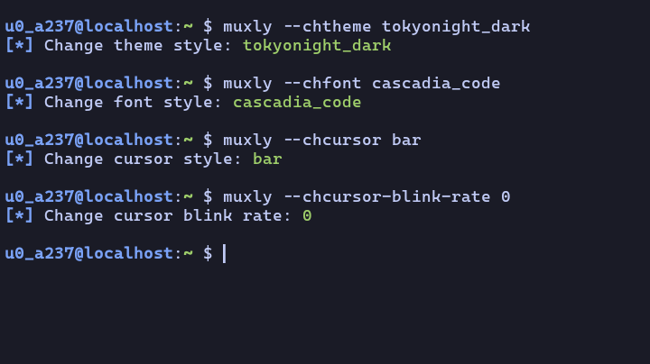
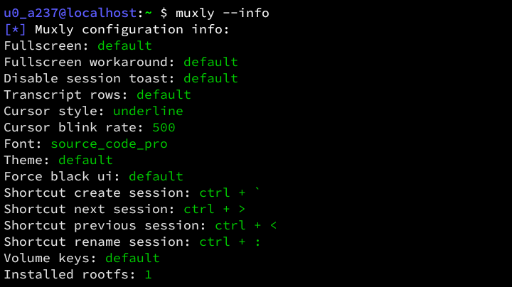
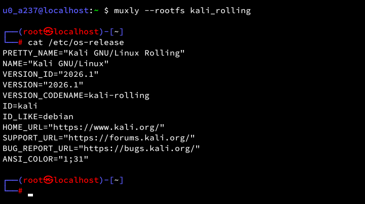

<!-- Muxly Project -->

[]()
[]()
[](LICENSE)

# Muxly
Muxly is a Swiss Army knife for Termux customization. <br>
It simplifies managing fonts, themes, cursor styles, shortcuts, and rootfs.

## Preview
<details>
<summary>Show Preview</summary>
<br>

<br><br>

<br><br>

<br>
</details>

## Features
- Easy font and theme customization
- Flexible cursor and shortcut controls
- Root filesystem (Linux distro) management
- Simple and intuitive CLI experience
- Real-time configuration updates
- And more

## Disclaimer
Muxly modifies important Termux files such as **'~/.termux/*'** and **'/data/data/com.termux/files/usr/var/lib/proot-distro/installed-rootfs/*'**. <br>
If you are not comfortable with potential risks, please back up your data first. <br>
Use this tool at your own risk.

## Installation
```bash
git clone https://github.com/Zeronetsec/Muxly.git
cd Muxly
chmod +x install.sh
./install.sh

# for backup
./install.sh --backup
```

## Usage
```bash
muxly --chfont <font>
muxly --chtheme <theme>
muxly --chcursor <block|underline|bar>
muxly --fullscreen <true|false>
muxly --shortcut-create-session <value>
muxly --disable-session-toast <true|false>
muxly --install-rootfs <distro>
muxly --volume-keys <value>
```
And more commands.

## Credits
- [Termux Styling](https://f-droid.org/id/packages/com.termux.styling/)
- [PRoot Distro](https://github.com/termux/proot-distro)

## License
This project is licensed under the MIT License. <br>

<!-- Copyright (c) 2026 Zeronetsec -->